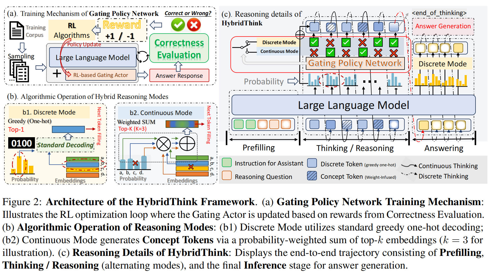
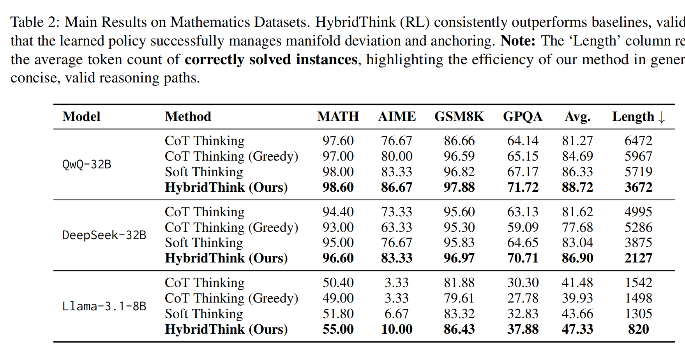
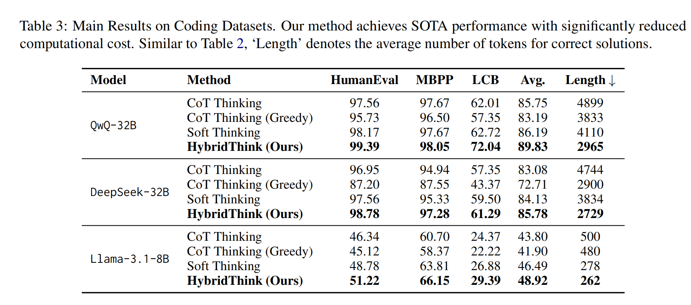

# HybridThink: Learned Interleaving of Continuous and Discrete Reasoning in Large Language Models

This project is forked from [https://github.com/eric-ai-lab/Soft-Thinking/tree/main](https://github.com/eric-ai-lab/Soft-Thinking/tree/main)

This repository provides the official implementation of **HybridThink**, a framework that optimizes reasoning in Large Language Models (LLMs) by dynamically interleaving continuous concept tokens with discrete text tokens.

---

## 📌 About HybridThink
   
<p align="center">
  
  <br>
  <em>Figure 1: The main architecture of HybridThink featuring the learned gating policy.</em>
</p>

HybridThink addresses two critical challenges in LLM reasoning:
1.  **Manifold Deviation**: Accumulation of Out-of-Distribution (OOD) states in continuous reasoning.
2.  **Anchoring Problem**: Indeterminate termination caused by the absence of clear semantic boundaries.

By formulating mode selection as a sequential decision process, HybridThink employs a **lightweight gating policy** trained with Reinforcement Learning (RL). This policy decides at each step whether to propagate a continuous concept or anchor the trajectory with a discrete token. The training is stabilized using **Error-Centric Experience Replay (ECER)** and **Inductive Exploration Shaping (IES)**.

---

## 📊 Experimental Results

We evaluated HybridThink across multiple reasoning benchmarks. The results are summarized in the tables below:

<p align="center">
  
  <br>

[//]: # (  <em>Figure 2: Performance comparison of HybridThink on general reasoning benchmarks.</em>)
</p>

<p align="center">
  
  <br>

[//]: # (  <em>Figure 3: Detailed performance metrics and ablation studies on math and coding tasks.</em>)
</p>

---

## 🛠 Installation

Follow these steps to set up the environment. We recommend using Python 3.11 and CUDA-enabled hardware.

```bash
# 1. Create and activate the conda environment
conda create -n HybridThink python=3.11 -y && conda activate HybridThink

# 2. Install core dependencies
pip install --upgrade pip
pip install torch transformers accelerate jsonlines math_verify openai torch_memory_saver

# 3. Install Flash Attention (required for performance)
# This may take approximately 20 minutes.
pip install flash_attn --no-build-isolation 

# 4. Install the Soft-Thinking optimized SGLang package
cd sglang_soft_thinking_pkg
pip install -e "python[all]"
cd ..
```

---

## 🚀 Running the Pipeline

The project is organized into modular scripts for training and multi-stage evaluation.

### 1. Training
To train the gating policy from scratch or fine-tune it:
```bash
bash scripts/train_ppo.sh
```

### 2. Evaluation
To verify the performance on standard benchmarks (GSM8K, MATH, etc.):
```bash
# For general reasoning and mathematics
bash scripts/batch_dataset_ppo_eval.sh

# For coding benchmarks
bash scripts/batch_code_ppo_eval.sh
```

### 3. Code Re-evaluation (Post-Processing)
Since coding results require an isolated execution environment for verification, run this script after the initial coding evaluation completes:
```bash
bash scripts/run_code_reeval.sh
```

### 4. LiveCodeBench (LCB)
For specialized evaluation on LiveCodeBench, ensure you have downloaded the necessary packages and datasets:
```bash
bash scripts/run_local_lcb.sh
```

---

## 📊 Experiment Workflow

| Phase | Script | Description |
| :--- | :--- | :--- |
| **Training** | `train_ppo.sh` | Policy training using RL with ECER and IES strategies. |
| **Validation** | `batch_..._eval.sh` | Batch inference across datasets to test gating stability. |
| **Code-Check** | `run_code_reeval.sh` | Separate process for sandboxed code execution and scoring. |
| **Benchmark** | `run_local_lcb.sh` | Dedicated evaluation for the LiveCodeBench suite. |

---

[//]: # (## 🔗 Repository & Citation)

[//]: # ()
[//]: # (If you use HybridThink in your research, please cite our work:)

[//]: # ()
[//]: # (**Code:** [https://github.com/SmileHappyEveryDay/Hybrid-Thinking]&#40;https://github.com/SmileHappyEveryDay/Hybrid-Thinking&#41;)

[//]: # ()
[//]: # (```bibtex)

[//]: # (@article{hybridthink2025,)

[//]: # (  title={HybridThink: Learned Interleaving of Continuous and Discrete Reasoning in Large Language Models},)

[//]: # (  author={Anonymous Authors},)

[//]: # (  journal={arXiv preprint},)

[//]: # (  year={2026})

[//]: # (})
[//]: # ```
